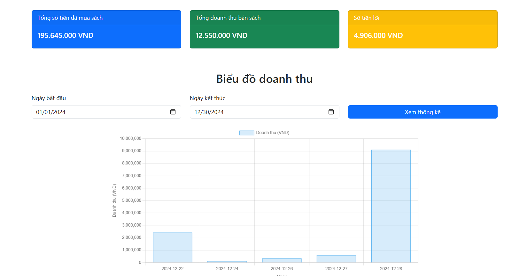
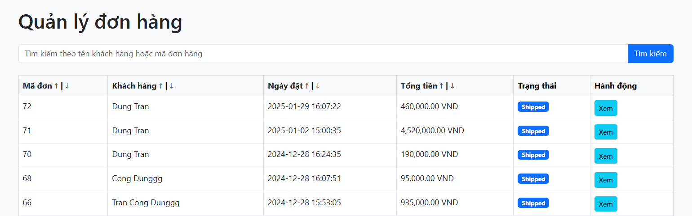
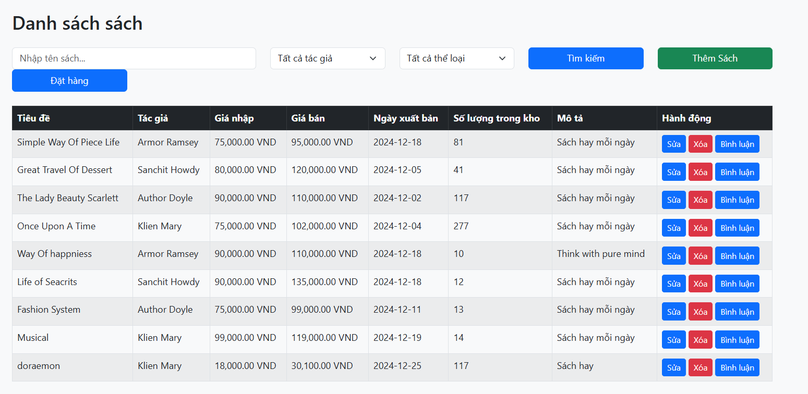

# 📚 Bookstore Management System PHP

A web-based eCommerce application for managing a bookstore, developed using PHP. This system enables both store administrators and customers to interact through a clean and functional interface.

It supports book sales, order management, and profit/loss statistics, making it a useful tool for small to medium-sized bookstore operations**.

## 📸 Demo Screenshots

# 👩‍💼 Admin Pages
Manage books, track orders, and view business statistics.

- 📊 Statistical Dashboard  
  

- 📦 Order Status Management  
  

- 📑 Order Detail View  
  

- 📚 Book Management  
  

---

## 👨‍💻 Customer Pages
Browse, purchase, and track books easily.

- 🏠 Homepage  
  

- 📘 Book Detail View  
  

- 🛒 Shopping Cart  
  

- 💳 Checkout Process  
  

- 📬 Order Tracking  
  

---

### 🛠 Technologies Used

- **Language**: PHP 
- **Frontend**: HTML, CSS, JavaScript
- **Database**: MySQL
- **Web Server**: Xampp

---

## 🚀 Setup Instructions

**Clone or download**
   git clone https://github.com/DT2293/bookphp.git
   database: BOOKPHP/BookDb.txt
